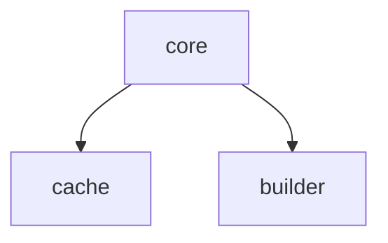
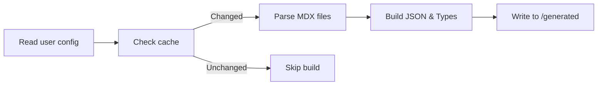
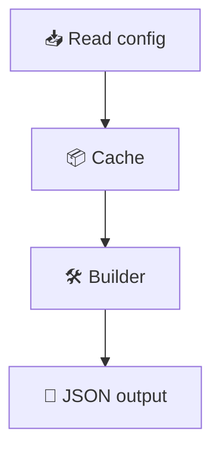
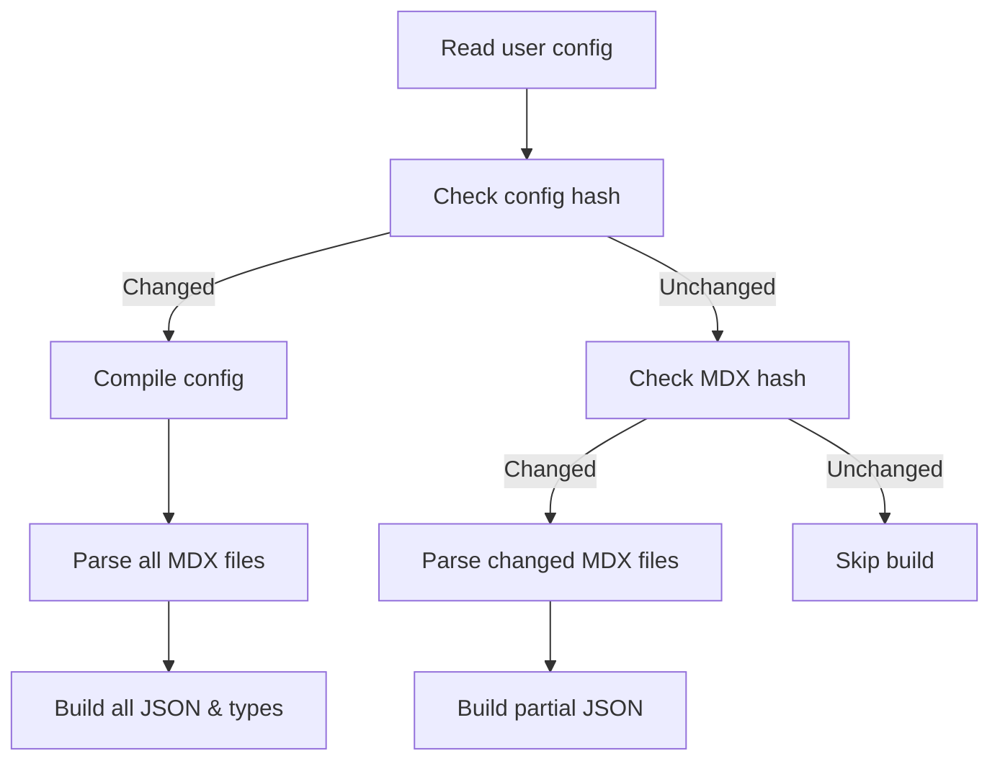

## Core

```mermaid
graph TD
core --> cache
core --> builder
```

## Config

```mermaid
graph LR
  config[Read user config] --> check[Check cache]
  check -->|Changed| parse[Parse MDX files]
  parse --> build[Build JSON & Types]
  build --> output[Write to /generated]
  check -->|Unchanged| skip[Skip build]
```

```mermaid
graph TD
  A[📥 Read config] --> B[📦 Cache]
  B --> C[🛠️ Builder]
  C --> D[📝 JSON output]
```

```mermaid
graph TD
  config[Read user config] --> checkConfig[Check config hash]
  checkConfig -->|Changed| compile[Compile config]
  compile --> parseAll[Parse all MDX files]
  checkConfig -->|Unchanged| checkMdx[Check MDX hash]
  checkMdx -->|Changed| parseChanged[Parse changed MDX files]
  parseAll --> buildAll[Build all JSON & types]
  parseChanged --> buildChanged[Build partial JSON]
  checkMdx -->|Unchanged| skip[Skip build]
```
